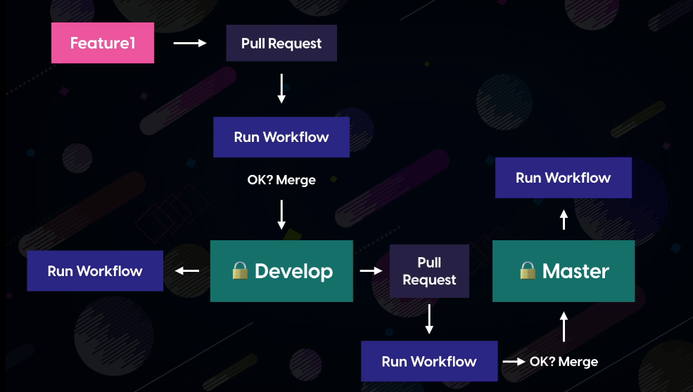

## Deploy

deploy project in surge. First we need to register and login in surge.

Globally install surge

```
npm install --global surge
```

then they give us a link like `lively-pig.surge.sh`

We will build a github workflow look like this


- If a job fail, then workflow create an issue automatically and send a slack notification message.
- If release create then send slack message.
